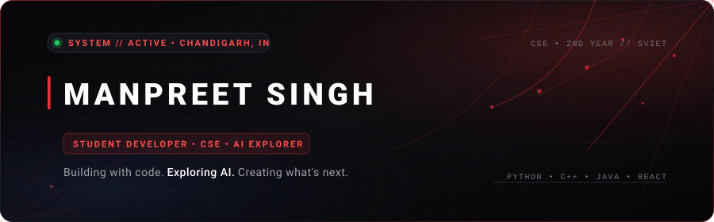
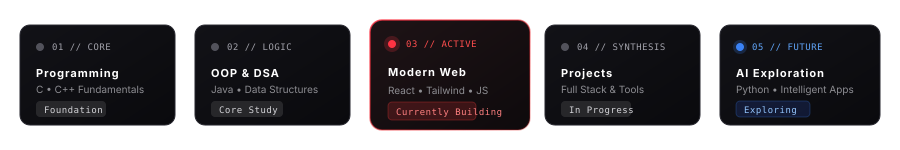
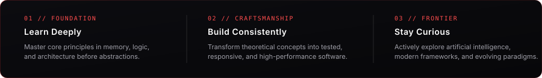

<div align="center">

<!-- HERO BANNER -->


<br />

# MANPREET SINGH
### `STUDENT DEVELOPER` • `CSE` • `AI EXPLORER`

<p align="center">
  <em>Building with code. Exploring AI. Creating what's next.</em>
</p>

<!-- TOP STATUS CHIPS -->
<p align="center">
  <a href="https://github.com/mxnpreet7">
    
  </a>
  <a href="https://www.linkedin.com/in/manpreet-singh-7063703b2/">
    
  </a>
  <a href="mailto:iammanpreet640@gmail.com">
    
  </a>
</p>


</div>

<br />

## 🕷️ 01 // ABOUT ME

```yaml
developer:
  name: Manpreet Singh
  role: Student Developer
  education:
    degree: Bachelor of Technology (Computer Science & Engineering)
    year: 2nd Year
    institution: Swami Vivekanand Institute of Engineering and Technology (SVIET)
  location: Chandigarh, India
  born: 2008
  core_drive: "Bridging software fundamentals with modern web engineering and artificial intelligence."
```

I am a second-year Computer Science Engineering student based in Chandigarh, focused on mastering computer science fundamentals and building fast, responsive, and aesthetically refined web applications. 

My journey combines a deep appreciation for low-level logic (C, C++, Java) with a passion for modern frontend architecture (React, Tailwind CSS, JavaScript) and emerging artificial intelligence paradigms. I believe in writing code that is clean, modular, and intentionally crafted.

<br />

<div align="center">

</div>

<br />

## ⚡ 02 // CURRENTLY BUILDING & EXPLORING

<table>
  <tr>
    <td width="33%" valign="top">
      <h4>🕸️ Modern Web Systems</h4>
      <p>Architecting responsive, high-performance interfaces with <strong>React.js</strong> and <strong>Tailwind CSS</strong>, emphasizing accessible UX and component reusability.</p>
    </td>
    <td width="33%" valign="top">
      <h4>⚙️ Algorithmic Foundations</h4>
      <p>Strengthening core problem-solving, data structures, and object-oriented architectures in <strong>C++</strong>, <strong>Java</strong>, and <strong>Python</strong>.</p>
    </td>
    <td width="33%" valign="top">
      <h4>🧠 AI &amp; Emerging Tech</h4>
      <p>Exploring practical applications of artificial intelligence, intelligent workflows, and modern developer tooling.</p>
    </td>
  </tr>
</table>

<br />

<div align="center">

</div>

<br />

## 🛠️ 03 // TECH STACK & ARSENAL

A deliberate selection of languages, technologies, and developer tooling supported by my active codebase.

<br />

<div align="center">

### `CORE LANGUAGES`
<p>
  
  &nbsp;
  
  &nbsp;
  
  &nbsp;
  
</p>

### `FRONTEND & WEB DEVELOPMENT`
<p>
  
  &nbsp;
  
  &nbsp;
  
  &nbsp;
  
  &nbsp;
  
</p>

### `DEV TOOLS & WORKFLOW`
<p>
  
  &nbsp;
  
  &nbsp;
  
  &nbsp;
  
</p>

</div>

<br />

<div align="center">

</div>

<br />

## 🚀 04 // FEATURED REPOSITORIES & PROJECTS

<table>
  <tr>
    <td width="50%" valign="top">
      <h3>🌐 Personal Developer Portfolio</h3>
      <p>A modern, high-performance developer portfolio featuring a cinematic dark/light theme, dynamic project catalogs, responsive navigation, and mobile-first architecture.</p>
      <p>
        <code>React.js</code> • <code>Tailwind CSS</code> • <code>Vite</code> • <code>Lucide Icons</code>
      </p>
      <p>
        🔗 <a href="https://github.com/mxnpreet7/portfolio"><strong>View Repository</strong></a>
      </p>
    </td>
    <td width="50%" valign="top">
      <h3>💻 Responsive Web Applications Hub</h3>
      <p>A collection of responsive frontend interfaces and components demonstrating state management, clean layout hierarchies, and modern CSS utility patterns.</p>
      <p>
        <code>React.js</code> • <code>JavaScript</code> • <code>Tailwind CSS</code> • <code>HTML5</code>
      </p>
      <p>
        🔗 <a href="https://github.com/mxnpreet7"><strong>Explore Profile Projects</strong></a>
      </p>
    </td>
  </tr>
  <tr>
    <td width="50%" valign="top">
      <h3>⚡ Algorithm &amp; Logic Showcase</h3>
      <p>Algorithmic implementations, object-oriented design structures, and logic exercises exploring clean, efficient computing fundamentals.</p>
      <p>
        <code>C++</code> • <code>Java</code> • <code>Python</code> • <code>DSA</code>
      </p>
      <p>
        🔗 <a href="https://github.com/mxnpreet7"><strong>View Implementations</strong></a>
      </p>
    </td>
    <td width="50%" valign="top">
      <h3>🧠 Emerging Tech &amp; AI Explorations</h3>
      <p>Experimental scripts, automation workflows, and research investigations into artificial intelligence and intelligent software systems.</p>
      <p>
        <code>Python</code> • <code>AI Tools</code> • <code>Automation</code>
      </p>
      <p>
        🔗 <a href="https://github.com/mxnpreet7"><strong>View Experiments</strong></a>
      </p>
    </td>
  </tr>
</table>

<br />

<div align="center">

</div>

<br />

## 🗺️ 05 // LEARNING TRAJECTORY

<div align="center">
  
</div>

<br />

| Stage | Domain | Focus & Key Technologies | Status |
| :--- | :--- | :--- | :---: |
| **01 // Core** | Systems & Programming | C • C++ Fundamentals • Memory & Syntax | `SOLIDIFIED` |
| **02 // Logic** | OOP & Data Structures | Java • Object-Oriented Principles • Problem Solving | `IN PROGRESS` |
| **03 // Web** | Modern Web Engineering | React.js • Tailwind CSS • JavaScript (ES6+) • Responsive UX | `ACTIVE` |
| **04 // Build** | Full-Spectrum Projects | Web Applications • Developer Tools • Clean Architecture | `BUILDING` |
| **05 // Future** | Artificial Intelligence | Python • Applied AI • Intelligent Interfaces | `EXPLORING` |

<br />

<div align="center">

</div>

<br />

## 🕸️ 06 // THE WEB & GITHUB METRICS

<div align="center">
  <p><em>"Code &rarr; Build &rarr; Learn &rarr; Improve &rarr; Repeat"</em></p>
  <br />

  <!-- GitHub Minimalist Readme Stats Cards (Spider-Man Dark Theme: #070709 bg, #FF3344 title/accents, #FFFFFF text) -->
  <a href="https://github.com/mxnpreet7">
    
  </a>
  &nbsp;
  <a href="https://github.com/mxnpreet7">
    
  </a>
</div>

<br />

<div align="center">

</div>

<br />

## 🕷️ 07 // DEVELOPER PHILOSOPHY

<div align="center">
  
</div>

<br />

- **01 // Learn Deeply:** Never settle for surface-level abstractions. Understand the fundamental mechanics of computing, memory, and algorithms.
- **02 // Build Consistently:** Ideas become reality through continuous execution. Ship clean, responsive, and performant code.
- **03 // Stay Curious:** Embrace new tools, explore artificial intelligence, and perpetually refine the craft.

<br />

<div align="center">

</div>

<br />

## 📡 08 // LET'S CONNECT

<p align="center">
  Whether discussing web development, computer science concepts, collaborative student projects, or internship opportunities — feel free to reach out.
</p>

<div align="center">

<a href="https://github.com/mxnpreet7">
  
</a>
&nbsp;&nbsp;
<a href="https://www.linkedin.com/in/manpreet-singh-7063703b2/">
  
</a>
&nbsp;&nbsp;
<a href="mailto:iammanpreet640@gmail.com">
  
</a>

</div>

<br />

<div align="center">
  
</div>
